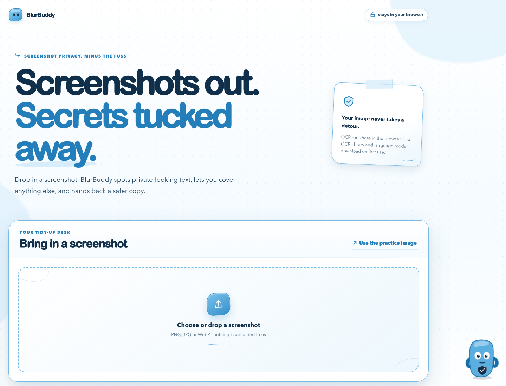

# BlurBuddy

**Share the screenshot. Keep the secrets.**

BlurBuddy is a browser-based privacy tool built for a cybersecurity friend who regularly shares screenshots while teaching, documenting incidents, and helping other people stay safe online.

It uses open-source OCR to find sensitive information in screenshots, then lets the user review, manually add redactions, and download a safer copy. Bloo, a tiny animated privacy buddy drawn entirely with inline SVG and CSS, reacts to each scan and helps make the process feel a little less clinical.



## Why open-source AI matters

BlurBuddy uses [Tesseract.js](https://github.com/naptha/tesseract.js) for OCR. Recognition runs inside the browser instead of uploading private screenshots to an application server. The user can inspect the implementation, change the detection rules, and keep control of the image throughout the process.

## Features

- Local OCR-based detection with Tesseract.js
- Automatic checks for emails, phone numbers, IP addresses, URLs and secret-like labels
- Custom words or project codenames to protect
- Manual drag-to-blur for anything the scan misses
- Adjustable pixelation strength
- One-click safe PNG download
- Built-in sample screenshot for a quick demo
- Distinctive blue, laminated-inspired interface with strong focus and interaction states
- Animated Bloo mascot with scanning, success and error reactions
- Reduced-motion support and a smaller, less intrusive mobile mascot

## Run locally

```bash
npm start
```

Then open [http://localhost:4173](http://localhost:4173).

The OCR library and English recognition data are fetched on first use, so the first scan needs an internet connection. The screenshot itself is processed in the browser and is not sent to a BlurBuddy backend. Bloo and the rest of the visual design require no external image assets.

## Test

```bash
npm test
```

## Privacy note

Automatic redaction is assistance, not a guarantee. BlurBuddy asks the user to review the image and provides manual redaction before download.

## Built for Hacktoberfest 2026

Created for the DEV Hacktoberfest Weekend Challenge: **Build for a Friend**.
